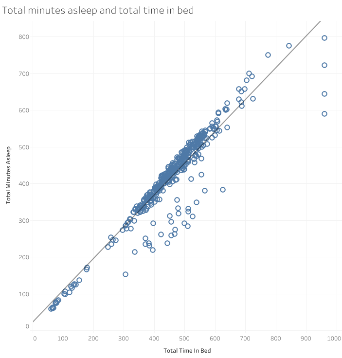
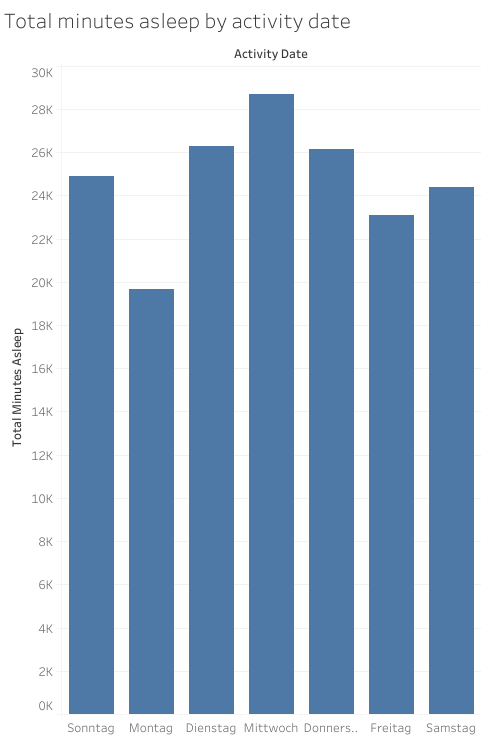
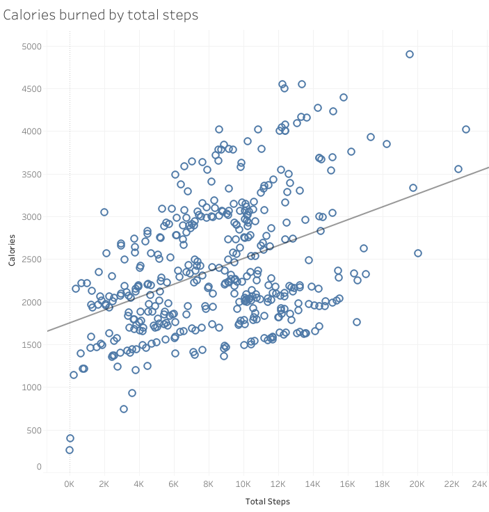
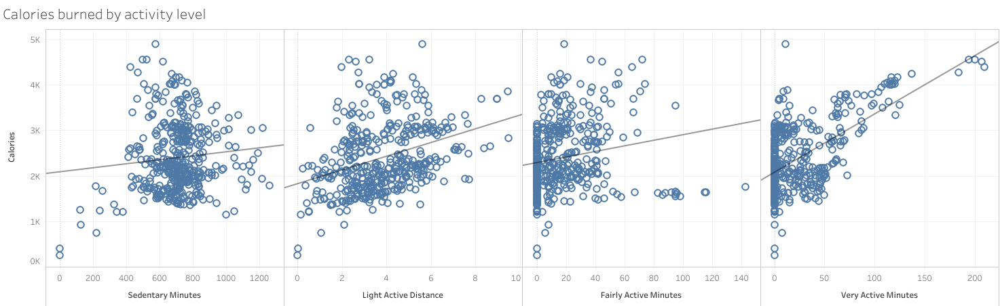
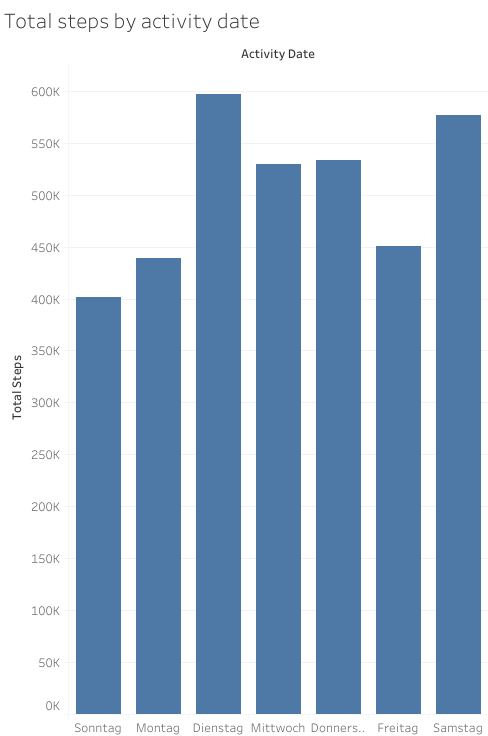
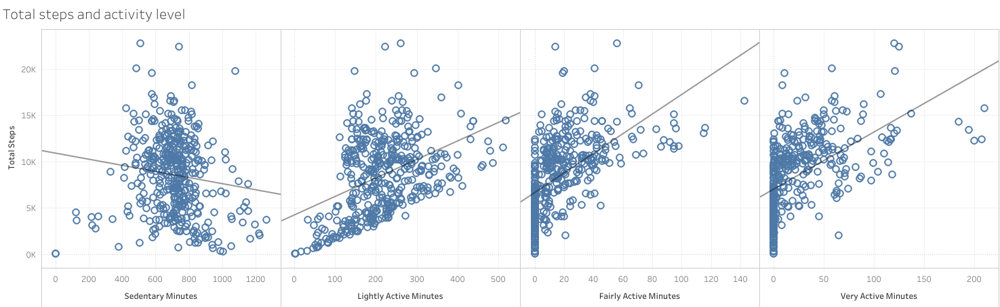
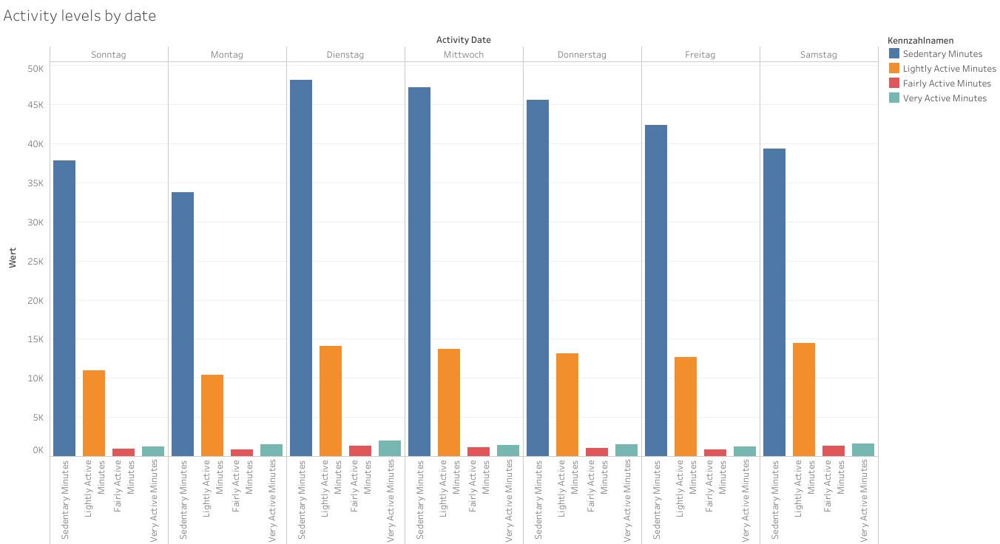

# How Can a Wellness Technology Company Play It Smart?
A Data Analyst Practice Project.

## Goal
The goal is to analyze Bellabeat smart device usage data in order to gain insight into how consumers use smart devices. I will analyze trends in smart device usage and how these trends are applied to the customers and how these trends can influence the marketing strategy of the Bellabeat company.


## Data Preparation

The data is publicly available: (https://www.kaggle.com/datasets/arashnic/fitbit?resource=download). 2 folders with multiple .csv files can be found called mturkfitbit_export_4.12.16-5.12.16 and mturkfitbit_export_3.12.16-4.11.16. 
Following files were chosen from the mturkfitbit_export_4.12.16-5.12.16 for this analysis:

dailyActivity_merged.csv
dailyCalories_merged.csv
dailyIntensities_merged.csv
dailySteps_merged.csv
sleepDay_merged.csv

Those files contain data about the activity type, amount of activity, calories burned, total steps and hours slept by the users, which is the focus of this analysis. The data are organised in long format, where each observed data point has its own row. There are fewer users documented in the sleepDay_merged.csv file compared to all the others, which needs to be considered during preprocessing of the data. Assuming that the devices measure all these values accurately, the data is reliable, since they are the primary source and are derived from direct measurements.


## Preprocessing

For preprocessing I chose RStudio.

**Importing Libraries**
```
install.packages("tidyverse") 
library(tidyverse)
```
**Manually import .csv dataset and assign to variable**
```
daily_activity = dailyActivity_merged
daily_calory = dailyCalories_merged
daily_intensities = dailyIntensities_merged
daily_steps = dailySteps_merged
daily_sleep = sleepDay_merged
```
**Checking number of IDs (customers)**
```
# n_distinct(df$id_column) 
n_distinct(daily_activity$Id) # 33
n_distinct(daily_calory$Id) # 33
n_distinct(daily_intensities$Id) # 33
n_distinct(daily_steps$Id) # 33
n_distinct(daily_sleep$Id) # 24
```
**Checking columns**
```
colnames(daily_activity)
colnames(daily_calory)
colnames(daily_intensities)
colnames(daily_steps)
colnames(daily_sleep)
```
**Checking data types**
```
str(daily_activity)
str(daily_calory)
str(daily_intensities)
str(daily_steps)
str(daily_sleep)
```
**Checking rows**
```
nrow(daily_activity) # 940
nrow(daily_calory) # 940
nrow(daily_intensities) # 940
nrow(daily_steps) # 940
nrow(daily_sleep) # 413
```
**Simplify data, since daily activity dataset contains columns from other dataframes**
```
sleep_ids = unique(daily_sleep$Id)
sleep_ids
```
**Checking if subset of others**
```
all(sleep_ids %in% daily_activity$Id)
all(sleep_ids %in% daily_steps$Id)
all(sleep_ids %in% daily_calory$Id)
all(sleep_ids %in% daily_intensities$Id)
## all true
```
**Reducing to 24 sleep IDs**
```
daily_activity    <- daily_activity %>% filter(Id %in% sleep_ids)
daily_calory      <- daily_calory %>% filter(Id %in% sleep_ids)
daily_intensities <- daily_intensities %>% filter(Id %in% sleep_ids)
daily_steps       <- daily_steps %>% filter(Id %in% sleep_ids)
```
**Checking number of IDs**
```
n_distinct(daily_activity$Id) # 24
n_distinct(daily_calory$Id) # 24
n_distinct(daily_intensities$Id) # 24
n_distinct(daily_steps$Id) # 24
n_distinct(daily_sleep$Id) # 24
```
**Displaying raw data to see if the data looks the same**
```
head(daily_activity$ActivityDate)
head(daily_sleep$SleepDay)
```
**Checking data range**
```
range(daily_activity$ActivityDate)
range(daily_sleep$SleepDay)
```
**Checking data type**
```
class(daily_activity$ActivityDate)
class(daily_sleep$SleepDay)
```
**Since there are 2 different time formats, we need to reduce it to one**
```
daily_sleep <- daily_sleep %>%
  rename(ActivityDate = SleepDay) %>%
  mutate(ActivityDate = as.Date(ActivityDate, format = "%m/%d/%Y %I:%M:%S %p"))

daily_activity <- daily_activity %>%
  mutate(ActivityDate = as.Date(ActivityDate, format = "%m/%d/%Y"))
```
**Check if conversion of time format works**
```
class(daily_activity$ActivityDate)  # shows "Date"
class(daily_sleep$ActivityDate)     # shows "Date" 
head(daily_sleep$ActivityDate)    
```
**Merging dataset & reviewing new merged dataset**
```
merged_df <- daily_activity %>%
  inner_join(daily_sleep, by = c("Id", "ActivityDate"))

nrow(merged_df)
ncol(merged_df)
n_distinct(merged_df$Id)
head(merged_df)
```


## Analysis

Taking a look at summary statistics:
```
summary(merged_df)

summary(merged_df$TotalMinutesAsleep)
```

**Exporting dataset for visualization with Tableau**
```
write.csv(merged_df, "C:/Users/Money/OneDrive/Desktop/fitbit_cleaned.csv", row.names=FALSE)
```


## Results

The following results are based on a sample of 24 users. While the patterns observed are consistent, a larger sample size would be necessary to draw more generalizable conclusions.

### Sleep

There is a strong positive correlation between time spent in bed and actual sleep duration (R² = 0.87), suggesting that time in bed is a reliable predictor of sleep.



On average, users spend around 458 minutes (median: 463 minutes) in bed, of which approximately 419 minutes (median: 433 minutes) are spent asleep — meaning roughly 39 minutes per night are spent awake in bed. This puts average sleep just at the lower boundary of the commonly recommended 7–9 hours.



Sleep duration varies across the week, peaking on Wednesday and dropping to its lowest on Monday.


### Calories

Regarding caloric expenditure, the mean is 2,398 kcal/day with a median of 2,220 kcal/day, which are plausible values for total daily energy expenditure tracked by a fitness device. It is worth noting that the minimum value of 257 kcal likely reflects days where the device was not worn for the full day rather than actual low expenditure, as BMR alone would typically exceed this value. Caloric expenditure is highest on Tuesday and lowest on Monday, mirroring the step count pattern.



While a positive relationship between steps and calories burned is visible, the wide spread of data points suggests that individual factors such as body weight and activity intensity play a significant additional role.



Of all activity categories, very active minutes show the steepest positive relationship with calories burned, indicating that intensity matters more than duration for energy expenditure.

### Steps & Activity Levels

Daily step counts show a mean of 8,541 and a median of 8,925 steps — falling slightly below the widely cited 10,000-step benchmark. The minimum of 17 steps suggests days where the device was not worn.



Step counts are highest on Tuesday and Saturday, and lowest on Monday, suggesting users are less active at the start of the work week.



As expected, sedentary minutes are negatively correlated with total steps, while all active categories show positive correlations. Very active minutes in particular show a steep positive trend.



The activity level distribution paints a picture of a predominantly sedentary user base. On average, users accumulate 712 sedentary minutes per day (median: 717 minutes) — nearly 12 hours of waking inactivity. Lightly active minutes account for a mean of 217 minutes, while fairly active and very active minutes are strikingly low at only 18 and 25 minutes per day respectively. This means vigorous physical activity makes up less than 3% of the average waking day, which is a notable finding given that these are users who actively chose to wear a fitness tracker.

## Conclusion

Users are largely inactive despite having their behavior tracked. Bellabeat could implement reminders to break sedentary patterns. Because very active minutes burn calories the most, the integration of short high-intensity activities into the smart device experience should be taken into consideration, since step count goals could feel unachievable for sedentary users.
Weekly patterns in the data show that Monday is consistently the weakest day across steps, calories, and sleep, while Tuesday and Saturday are the most active. A targeted feature such as Monday motivation prompts or weekly challenge resets could help users build better habits from the start of the week, while weekend-timed challenges could capitalize on the natural increase in activity on Saturdays.